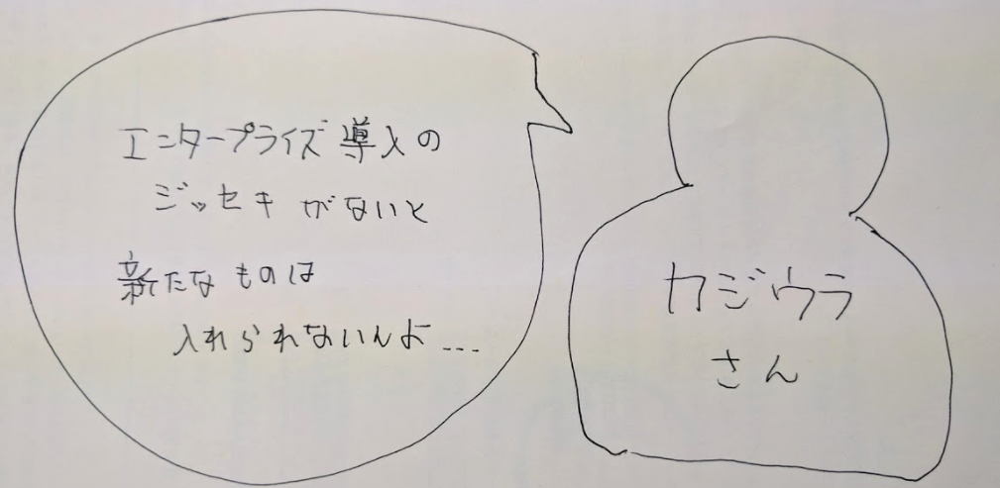
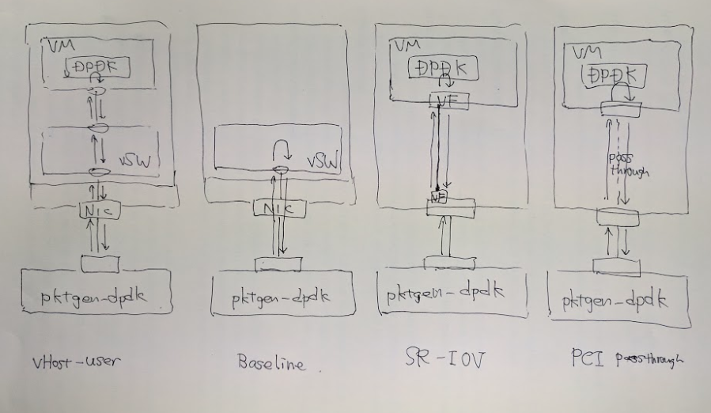
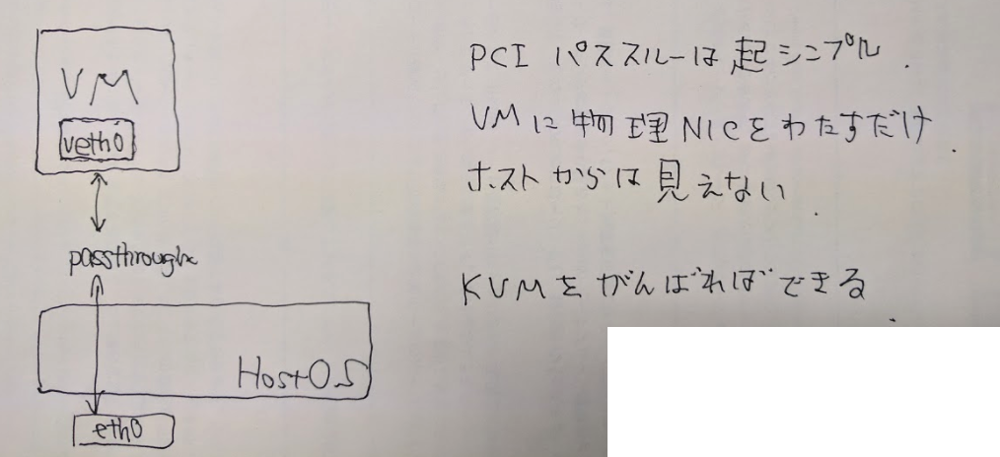
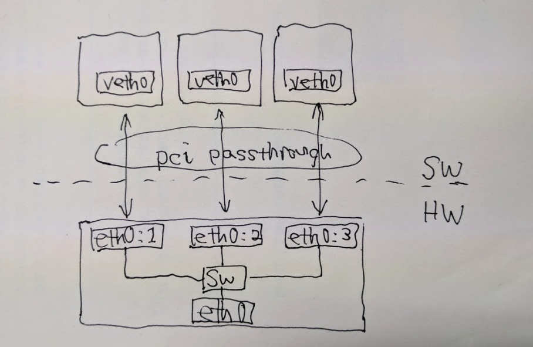
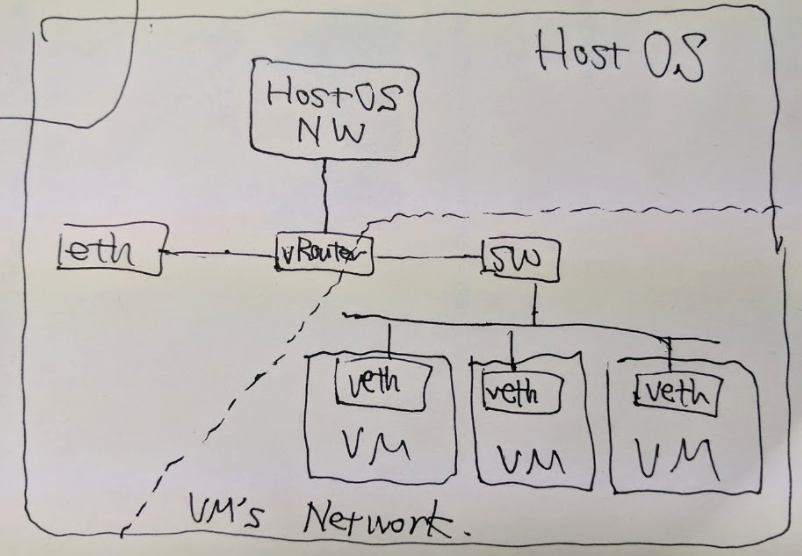
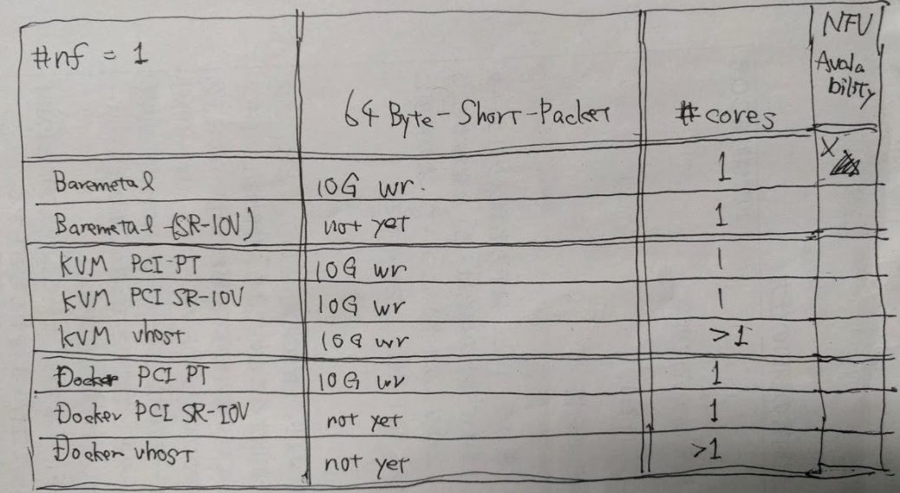
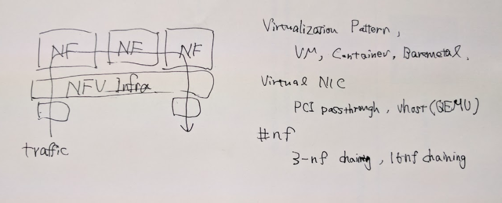

### Optimal system architecture in NFV

- Hiroki SHIROKURA
- slank.dev@gmail.com (@slakdev)

---

### Outline

- **Motivations & Contribution**
- Background
- System Design
- Evaluation
- Conclusion & Future Work

----

### High Performance Networking

- Line Rate High Performance Networking w/t COTS
  - DPDK/Netmap/XDP
- Flexible Hardware
  - FPGA/P4 asic

Virtualization Environment is standard now.

Today, HPN w/t DPDK is not introduction to NW.

ex. AWS is hibrid virtualization w/t HW.

----

### Network Functions Virtualization (NFV)

----

### Service Function Chaining

----

### KVM based Hypervisor in AWS

- VMのネットワーク処理は低価格ASICにオフロード
- サーバCPUはVMの計算のみに使用可能に

https://aws.amazon.com/jp/blogs/aws/now-available-compute-intensive-c5-instances-for-amazon-ec2/

http://www.publickey1.jp/blog/17/awskvmc5.html

- このままではNW処理はまたハードウェアに取られちまう

----

### Why High Performance Networking w/t SOFTWARE...?

- Flexibility
	- Speedy Deploy,Modify,Update,Bugfix
	- 超スピード感のある世界になる
	- 巨人会社は中でいろんなことしてる
		- 独自プロトコル?
		- 独自NF (キメラopenflow)

- あり物技術でなんとかする時代の次

----

### DPDK VNFの導入困難性

- ジッセキとは...
- 一刻も早くエコシステムの加速をしないと

---

### Outline

- Motivations & Contribution
- **Background**
- System Design
- Evaluation
- Conclusion & Future Work

----

### Background

- NFVが次世代スタンダードになり, DPDKは良い
	- 仮想化環境(KVM/Docker)を用いてVNFをデプロイする
- ただでさえDPDKのシステム構成は多様
	- NW分野では複雑性により導入されない
	- プログラマ不足
	- 導入困難性
- 仮想化を用いるともっと多様 <-- 本研究
	- 仮想化オーバヘッド?
	- 仮想化手法
	- 仮想NIC
	- サービスチェイン方式

----

### Data Plane Development Kit (DPDK)

- 汎用PCでも低価格に (200 \* 諭吉san)
- 専用機器に匹敵する (40-100GbE \* 4-8)
- NW用途で使う時に最大限の性能を発揮できるようにする
- 開発フレームワーク

----

### What is Virtualization Overhead?

- わかっている人はすくないです
- こまで低レイヤになると見積もりが細かくなるので難しい
- では調べてみよう! 仮想化コンポーネントの評価

---

### Outline

- Motivations & Contribution
- Background
- **System Design**
- Evaluation
- Conclusion & Future Work

----

### System Design

----

### System Design

----

### System Design

| Parameter | Element                     |
| --------  | --------------------------- |
| compute   | KVM,Docker,Baremetal        |
| network   | PCI-PT,SR-IOV,vHost         |
| chain     | SR-IOV,OvS,OvS-dpdk         |

----

### Computing

- VM
- Container
- Baremetal

みなさんこれわかりますか?

----

### Computing: VM

- もっとも遅い
- もっともしっかりとカプセルできる
- 歴史ある
- DPDK使える(少し大変)
- Xen, KVM, VMWare, Bitvisor

----

### Computing: Container

- Baremetalと同じ性能
- 環境の隔離とデプロイコストが低い
- 新しい, 流行ってる
- DPDK使える(少し大変, 若干のLimitあり)
- Docker, LXC, FreeBSD-jail, etc...

----

### Computing: Baremetal

- 普通のLinuxのプロセス
- まあもっとも性能はいい
- 移動したり, 隔離したり, 難しい
- DPDK使える

----

### vNIC

- PCI-passthrough
- SR-IOV
- vHost

みなさんこれわかりますか?

(これは知ってなくてもいい...)

- 仮想化したい人は必修です

----

### vNIC: PCI-passthrough

----

### vNIC: SR-IOV

----

### vNIC: vHost

----

### Service Chain

- SR-IOV
- OvS
- OvS-dpdk
- Original

---

### Outline

- Motivations & Contribution
- Background
- System Design
- **Evaluation**
- Conclusion & Future Work

----

### Experiment

- Compare basic elements (prepare)
- NFV Experiment (3-10 nf chaining)

----

### Compare basic elements

----

### NFV Experiment

- これから頑張ります!
- これまでの構成は1つのVMでやっていた
- 今後はN個のVMを繋いでやる

---

### Outline

- Motivations & Contribution
- Background
- System Design
- Evaluation
- **Conclusion & Future Work**

----

### 最後に

- n(>1)個を両立させるのが大変だと理解
- エナジードリンクとか買ってください
- 40GbE-NICでもいいので買ってください
- お金が足りないです. NTTの研究費をほぼ使い切った

- サーバは借りる場所をみつけた
	- さくらインターネット社長から!!!
	- NTT未来ねっと研究所

- 研究室のメンバーが有望なら紹介します

